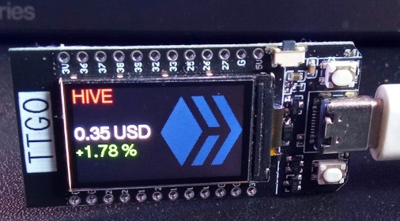

# hive-price-ticker

This project is a small TTGo-based HIVE Price ticker. It displays the HIVE price and the 24h change in percent and it refresh every 30 seconds.

## How to

If you want to use this, please follow [this tutorial](https://peakd.com/hive-189641/@bambukah/diy-hive-price-ticker-part-1).

